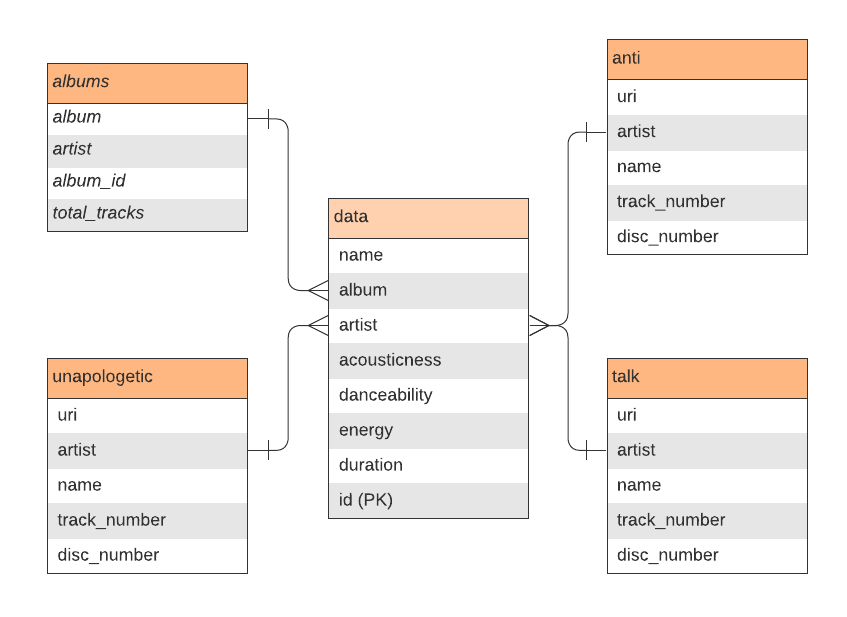

# CRUD APP using Spotify API


## Repo Structure

Repository mainly composed by:

- `templates`
- `.env`
- `app.py`
- `models.py`
- `requirements.txt`
- `spotifyapi.py`

## 1. Description

CRUD System using data from Spotify API. 

## 2. Entity Relationship (ER) Diagram

The database E/R diagram is shown here.



## 3. Installing
Install using [pip](https://pip.pypa.io/en/stable/quickstart/):

```
$ pip install flask flask-sqlalchemy psycopg2
```

## 4. Running
```
$ python3 spotifyapi.py
```

Both the update and delete views will need to fetch a post by id. Add the id as a PK in PostgreSQL:

```sql
ALTER TABLE data ADD COLUMN id SERIAL PRIMARY KEY;
```

```
$ flask run
 * Running on http://127.0.0.1:5000 (Press CTRL+C to quit)
```

## 4. Contents

* `templates`:
  - base.html
  - index.html
  - home.html
  - addsong.html
  - updatesong.html
*  `.env`: Environment variables
*  `app.py`: Main App
*  `models.py`: Model for the database
*  `requirements.txt`: Requirements for this project
*  `spotifyapi.py`: Notebook for extract the data from Spotify API
   
